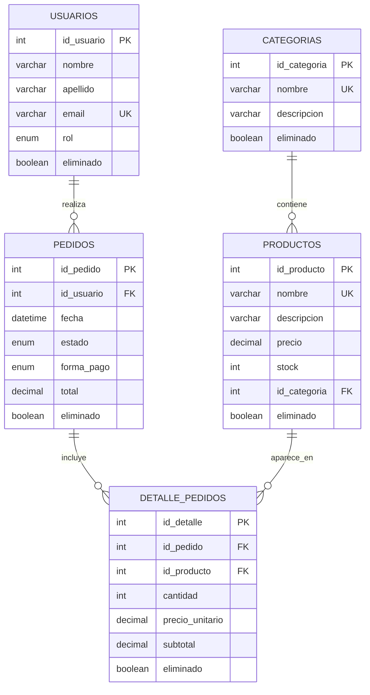

# DER - Modelo Food Store

## Explicacion del modelo

El modelo representa el sistema Food Store llevado a una base de datos relacional.

La tabla `categorias` organiza los productos. Cada categoria puede tener muchos productos, pero cada producto pertenece a una sola categoria.

La tabla `usuarios` almacena los usuarios que pueden realizar pedidos. Cada usuario puede tener muchos pedidos, pero cada pedido corresponde a un solo usuario.

La tabla `pedidos` representa la cabecera de la compra. Guarda el usuario, fecha, estado, forma de pago y total.

La tabla `detalle_pedidos` representa los productos que forman parte de cada pedido. Un pedido puede tener varios detalles, y cada detalle referencia un producto especifico.

## Cardinalidades

- `categorias` 1 a N `productos`.
- `usuarios` 1 a N `pedidos`.
- `pedidos` 1 a N `detalle_pedidos`.
- `productos` 1 a N `detalle_pedidos`.

## Justificacion

Se separa `pedidos` de `detalle_pedidos` porque un pedido puede incluir varios productos. De esta forma se evita repetir datos del pedido por cada producto comprado y se mantiene una estructura normalizada.

Tambien se guarda `precio_unitario` dentro de `detalle_pedidos` para conservar el precio historico del producto al momento de la venta, aunque el precio del producto cambie despues.

